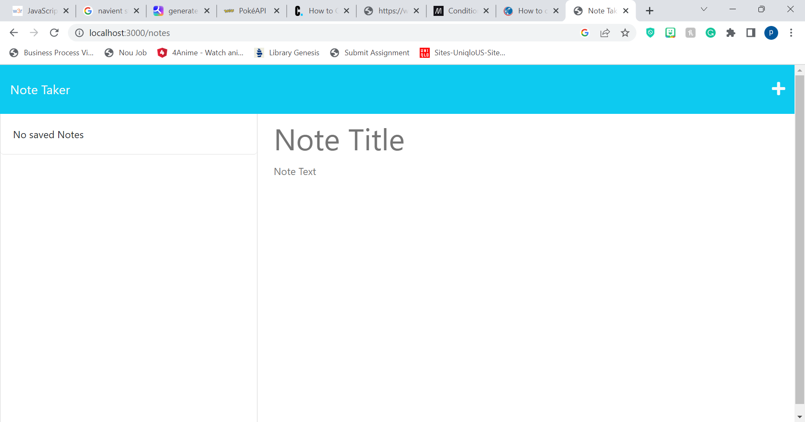

# Note Taker

Module 11: Express

## Table of Contents
1. [Description](#description)
1. [Submission](#submission)
2. [Visuals](#visuals)

## Description
This Note Taker application allows the user to write, save, and delete notes.This will use an Express.js back end and will save and retreive note data from a JSON file.

[GitHub Repo](https://github.com/por-chang/Express11)

## Submission

Can't seem to log into Heroku. Forgot Password and need to be paid

## Visuals
Here is a visual of the front-end of the webpage design.

 
